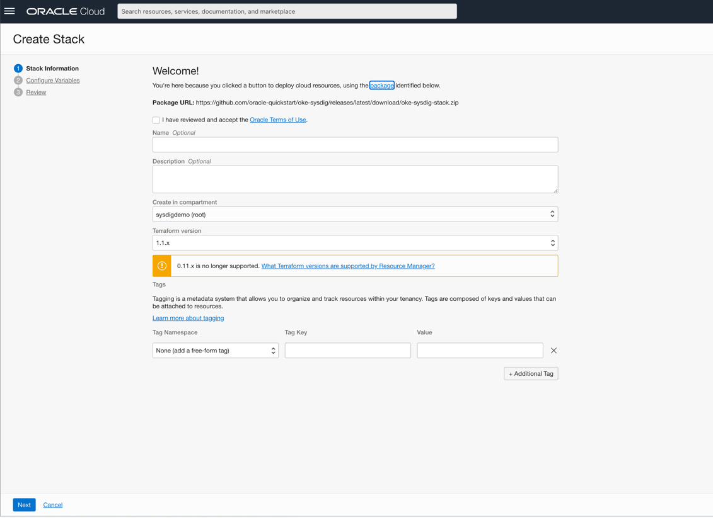

#       [![Deploy to Oracle Cloud][magic_button]][magic_sysdig_stack]

Terraform module that deploys the Sysdig Secure Agents in Oracle Kubernetes Engine (OKE) Cluster.

## Requirements
- An OCI account, the Oracle CLI (Resource Manager) and Terraform installed and configured. Find the step by step instructions in hte [Oracle QuickStart Prerequisites](https://github.com/oracle-quickstart/oci-prerequisites).
- A [Sysdig account](https://sysdig.com/company/start-free). Configuration parameters
  - Sysdig Access Key: From Sysdig panel go to Settings > Agent installation and copy the alphanumeric string.
  - [Agent Collector url, port and Node Image Analyzer endpoint](https://docs.sysdig.com/en/docs/administration/saas-regions-and-ip-ranges). Make sure to choose the right ones matching your SaaS region.
- If the Snyk integration is enabled, you need the Snyk monitor configured and running on the same cluster.

## Usage options
There are three ways to deploy this in your OCI infrastructure
- Using the magic button.
- Deploy using Terraform CLI.
- Upload the module to the Oracle Resource Manager.

### Using the magic button



1. Click the button [![Deploy to Oracle Cloud][magic_button]][magic_sysdig_stack] to go to the OCI deployment wizard.
2. Provide configuration parameters and credentials explained in the requirements section above.
3. Follow the wizard isntructions and run **Plan** check the stack.
4. Go to **Stack Page > Terraform Actions > Apply** to deploy the infrastructure.
5. If no longer need the infrastructure, run **Stack Page > Terraform Actions > Destroy**

### Using Terraform Scripts

Using Terraform (locally or via CloudShell), copy the file `terraform.tfvars.example` to `terraform.tfvars` and configure the variables. Make sure you have the OCI CLI installed and configured, then go ahead with terraform init, plan and apply.

Basic configuration example
````
# OCI authentication
tenancy_ocid     = "ocid1.tenancy.oc1..aaaaaaaahpra2di6l4levg7gtrb7w25xplkrba3dkclhcff48vofxuvv36pd"

# Deployment compartment
compartment_ocid = "ocid1.compartment.oc1..aaaaaaaatd5ktvvwe1r4mybei7nfqvcwfdsepggun4kvojgeh5mbibryy22tq"

# region
region = "us-sanjose-1"

# Sysdig
sysdig_access_key = "3e43321c-45ee-423d-b243-fab4d40cc87a"
sysdig_settings_collector = "ingest-us2.app.sysdig.com" # us-west
sysdig_settings_collector_port = "6443"
sysdig_node_analyzer_api_endpoint = "us2.app.sysdig.com" # us-west
````

## Start using Sysdig + OKE
This quickstart...

[magic_button]: https://oci-resourcemanager-plugin.plugins.oci.oraclecloud.com/latest/deploy-to-oracle-cloud.svg
[magic_sysdig_stack]: https://cloud.oracle.com/resourcemanager/stacks/create?zipUrl=https://github.com/oracle-quickstart/oke-sysdig/releases/latest/download/oke-sysdig-stack.zip
